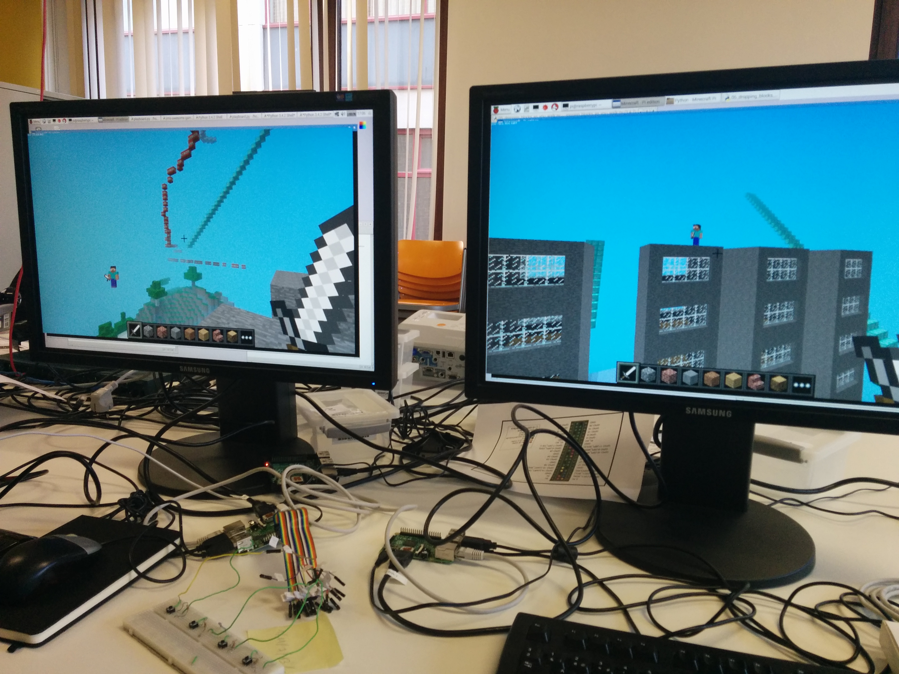

# Proof of concept - Minecraft Pi

## Table of contents

1. [Getting started with Minecraft Pi](#1-getting-started-with-minecraft-pi)
2. [Setup](#2-setup)
3. [Basics](#3-basics)
  1. [Using the Python programming interface](#31-using-the-python-programming-interface)
  2. [Setting the position of your player](#32-setting-the-position-of-your-player)
  3. [Placing a block](#33-placing-a-block)
  4. [Special blocks](#34-special-blocks)
  5. [Placing multiple blocks](#35-placing-multiple-blocks)
  6. [Placing blocks as you walk](#36-placing-blocks-as-you-walk)
4. [Advanced scripts](#4-advanced-scripts)
  1. [Generating stairs](#41-generating-stairs)
  2. [Pac-man eats all](#42-pac-man-eats-all)
  3. [Caging other players](#43-caging-other-players)
  4. [Using input from a light sensor](#44-using-input-from-a-light-sensor)
  5. [Whac-a-Block](#45-whac-a-block)
5. [Multiplayer](#5-multiplayer)
6. [Log](#6-log)


## 1. Getting started with Minecraft Pi

After installing Raspbian on the Raspberry Pi, you can get started playing with Minecraft Pi. You can manipulate the Minecraft world by writing scripts in Python. You can find the basic information on how to do this in the official Raspberry Pi Learning Resource: [Getting Started With Minecraft Pi](https://www.raspberrypi.org/learning/getting-started-with-minecraft-pi/worksheet/).

After trying these fun examples in Minecraft you can start creating your own creative stuff by using the full [Minecraft Pi API Reference](http://www.stuffaboutcode.com/p/minecraft-api-reference.html).

## 2. Setup


## 3. Basics

Here are some of the basics on manipulating the Minecraft world.

### 3.1 Using the Python programming interface

You can create a connection between Python 3 and Minecraft by using the following code:

```Python
from mcpi.minecraft import Minecraft

mc = Minecraft.create()
```

Post messages in chat by using the `mc.postToChat()` function.

```Python
mc.postToChat("Hello World! How's Steve?")
```

### 3.2 Setting the position of your player

Find your location in the world:

```Python
pos = mc.player.getPos()
```

Now you have access to your coordinates via the `pos` variable => `pos.x`, `pos.y` and `pos.z`.

You can also save it directly to `x`, `y` and `z` by using the following code.

```Python
x, y, z = mc.player.getPos()
```

Now that you have your location you can define your new location in relation to your current location or the world.

```Python
# in relation to your current position
mc.player.setPos(x, y+20, z+20)

# in relation to the base coordinates of the world
mc.player.setPos(10, 10, 10)
```

### 3.3 Placing a block

To place a single block use `mc.setBlock(x, y, z, block_id)`.

```Python
x, y, z = mc.player.getPos()

mc.setBlock(x+5, y, z, 1)
```

Of course it's a bit hard to remember the block ids of all blocks in Minecraft, so you'll probably want to use block constants. You can do this by importing the block module.

```Python
from mcpi import block
```

Now you can access block ids by using the blocks name, like this:

```Python
stone = block.STONE.id
wood_planks = block.WOOD_PLANKS.id
gold_ore = block.GOLD_ORE.id
gold_block = block.GOLD_BLOCK.id
```

Pretty easy right!

### 3.4 Special blocks

Some blocks have extra properties. For example you can specify the color of wool. You can set this extra property by including an extra parameter in `setBlock()`.

```Python
wool = block.WOOL.id
wool_color_white = 0  #default
wool_color_orange = 1
wool_color_magenta = 2

mc.setBlock(x, y, z, wool, wool_color_magenta)
```

To have a full list of blocks which have extra properties, see the [API Reference](http://www.stuffaboutcode.com/p/minecraft-api-reference.html).

### 3.5 Placing multiple blocks

To place multiple blocks in one line of code you can use the `setBlocks()` function.

```Python
stone = block.STONE.id
x, y, z = mc.player.getPos()

mc.setBlocks(x, y, z, x+5, y+5, z+5, stone)
```

### 3.6 Placing blocks as you walk

You've just learned how to get your location and place blocks, so let's combine these and place a grass block below you with a flower on top.

```Python
from mcpi.minecraft import Minecraft
from time import sleep

mc = Minecraft.create()

grass = block.GRASS.id
flower = block.FLOWER_CYAN.id

while True:
  x, y, z = mc.player.getPos()  #get your location
  mc.setBlock(x, y-1, z, grass) #place a grass block below you
  mc.setBlock(x, y, z, flower)  #place a flower on the block you just placed
  sleep(0.1)
```

The wile loop will go on forever, so to stop the script hit `Ctrl + C` in the Python window or close the Python window.

[See full code](./code/dropping_blocks_as_you_walk.py)

Video:


## 4. Advanced scripts

Using these basic functions from the API, I've created a few scripts myself to test what is possible in Minecraft Pi.

### 4.1 Generating stairs

This script will build stairs for you. It's placed about 10 blocks away from you.

Code snippet:

```Python
def placeStairs():
    #place stairs
    x, y, z = mc.player.getPos()
    x = x+10
    y -= 1

    i = 0

    while i < 20:
        x += 1
        y += 1

        mc.setBlock(x, y, z-1, stairs_wood)
        mc.setBlock(x, y, z, stairs_wood)
        mc.setBlock(x, y, z+1, stairs_wood)
        i += 1
        sleep(0.2)
```

[See full code](./code/stairs.py)

Video:

### 4.2 Pac-man eats all

This script is controlled by a button attached to one of the pins of the Raspberry Pi.

When you press the button the first time it will build pac-man one layer a time. If you press the button a second time it will create the pac-dots and if you press the button a third time pac-man will move forward and start eating the pac-dots.

Pac-man will destroy every block it eats, so if you're stuck in a cave just let him eat the walls!

Code snippet:

```Python
sensor = 23
gpio.setup(sensor, gpio.IN)

inputcount = 0

while True:
    sleep(0.2)
    if gpio.input(sensor) == 0:
        if inputcount == 0:
            buildPacman()
            inputcount += 1
            sleep(1)

        elif inputcount == 1:
            placeFood()
            inputcount += 1
            sleep(1)

        elif inputcount == 2:
            move()
            inputcount = 0
            sleep(1)
```

[See full code](./code/pacman.py)

Video:

### 4.3 Caging other players

This is a script that can also be used in multiplayer. First it will build a cage, then a player from the server will be teleported into the cage and after this the cage will be filled with lava. These steps are controlled by using a button attached to the Raspberry Pi.

Code snippet:

```Python
# put player in cage
def cagePlayer():
    mc.entity.setPos(players[0], x+2, y-2, z)
    sleep(2)

#fill cage with lava
def fillCageWithLava():
    mc.setBlock(x+2, y+1, z, air) #open roof
    mc.setBlock(x+2, y+2, z, lava) #place lava
    sleep(2)


sensor = 23
gpio.setup(sensor, gpio.IN)
inputcount = 0

while True:
    sleep(0.2)
    if gpio.input(sensor) == 0:
        if inputcount == 0:     #first button press
            buildCage()
            inputcount += 1

        elif inputcount == 1:   #second button press
            cagePlayer()
            inputcount += 1

        elif inputcount == 2:   #third button press
            fillCageWithLava()
            inputcount = 0    #reset
```

[See full code](./code/cage.py)

Video:

### 4.4 Using input from a light sensor

This one was a bit tricky because the light sensor I have is an analog sensor and the Raspberry Pi doesn't have analog inputs. So after some time searching the web, I found a post on how to read analog voltages without using an Analog-to-Digital Converter chip.

> By measuring the sensor as a resistor that is used to 'fill up' a capacitor, we can count how long it takes. It's not nearly as precise as an ADC and its a little flakey (since it depends on the Pi timing itself which can vary based on how 'busy' the computer is)

Source: [Basic Resistor Sensor Reading on Raspberry Pi](https://learn.adafruit.com/basic-resistor-sensor-reading-on-raspberry-pi/overview)

Using this technique I wrote some code to place blocks based on the reading of the sensor. The darker it is, the higher the row of blocks will become. This is constantly updated.

Code snippet:

```Python
def RCtime (RCpin):
    reading = 0
    GPIO.setup(RCpin, GPIO.OUT)
    GPIO.output(RCpin, GPIO.LOW)
    time.sleep(0.1)

    GPIO.setup(RCpin, GPIO.IN)
    # This takes about 1 ms per loop cycle
    while(GPIO.input(RCpin) == GPIO.LOW):
        reading += 1

    return reading


#blocks
air = block.AIR.id
gold_block = block.GOLD_BLOCK.id


x,y,z = mc.player.getPos()
sensorvalue = 0

while True:

    sensorvalue = RCtime(15)

    print (sensorvalue)   #print the reading

    mc.setBlocks(x+20, y, z-5, x+20, y + (sensorvalue / 10), z+5, gold_block)
    mc.setBlocks(x+20, y + (sensorvalue / 10), z-5, x+20, y + 100, z+5, air)
```

[See full code](./code/lightsensor_mc.py)

Video:

### 4.5 Whac-a-Block

This is a game where the blocks on the 3x3 playing field will be changed to another color. The goal is to hit every block that has another color as fast as possible so it changes back to the original color and you get a point. If all the blocks are changed at the same time, you lose.

Code snippet:

```Python
def playGame():
    #build the board
    pos = mc.player.getTilePos()

    mc.setBlocks(pos.x - 1, pos.y, pos.z + 3, pos.x + 1, pos.y +2, pos.z +3, stone)

    #countdown
    mc.postToChat("Get ready ...")
    time.sleep(1)
    mc.postToChat("3...")
    time.sleep(1)
    mc.postToChat("2...")
    time.sleep(1)
    mc.postToChat("1...")
    time.sleep(1)
    mc.postToChat("GO!")

    #light up blocks
    blocksLit = 0
    points = 0

    while blocksLit < 9:
        time.sleep(0.3)

        blocksLit += 1
        lightCreated = False
        while not lightCreated:
            xPos = pos.x + random.randint(-1, 1)
            yPos = pos.y + random.randint(0, 2)
            zPos = pos.z + 3

            if mc.getBlock(xPos, yPos, zPos) == stone:
                mc.setBlock(xPos, yPos, zPos, glowstone)
                lightCreated = True

        #register hits
        for hitBlock in mc.events.pollBlockHits():
            if mc.getBlock(hitBlock.pos.x, hitBlock.pos.y, hitBlock.pos.z) == glowstone:
                mc.setBlock(hitBlock.pos.x, hitBlock.pos.y, hitBlock.pos.z, stone)
                blocksLit -= 1
                points += 1


    #show message game over
    mc.postToChat("Game Over. You scored " + str(points) + " points.")
```

[See full code](./code/whac-a-block.py)

Video:

## 5. Multiplayer

In Minecraft Pi you're able to play with other people that are on the same network as you are. This is easy when you're at home, just connect to the same router and you're good to go.

It gets a bit trickier when you're in a public place like a school where different subnets are used on the network and you can't choose on which subnet you want to be. Here you'll want to connect the Pis to each other and set a static IP address on both of them. Make sure you configure them to be in the same subnet!

[Tutorial - How to give your Raspberry Pi a static IP address](http://www.modmypi.com/blog/tutorial-how-to-give-your-raspberry-pi-a-static-ip-address)

The part we need from this tutorial is where we configure the static IP. The file you will have to edit is located here `/etc/network/interfaces`.

By default this will be in the file:

```
auto lo

iface lo inet loopback
iface eth0 inet dhcp

allow-hotplu wlan0
iface wlan0 inet manual
wpa-roam /etc/wpa_supplicant/wpa_supplicant.conf
iface default inet dhcp
```

This is how the file will be after you've changed `iface eth0 inet dhcp` to `iface eth0 inet static` + the settings for a static IP address.

```
auto lo

iface lo inet loopback

iface eth0 inet static
address 192.168.1.2       #One of the players needs to change this to 192.168.1.3
netmask 255.255.255.0
network 192.168.1.0
broadcast 192.168.1.255
gateway 192.168.1.254

allow-hotplu wlan0
iface wlan0 inet manual
wpa-roam /etc/wpa_supplicant/wpa_supplicant.conf
iface default inet dhcp
```

After editing this file you will have to reboot.

Now one player has to start a game, the other player has to go to 'Join Game' and can join the first player's game from here.

Setup:



## 6. Log

- 15/12/2015: 1.5h - Trying out the basics of programming in Minecraft Pi
- 16/12/2015: 4.5h - stairs.py, dropping_blocks_as_you_walk.py, pacman.py
- 20/12/2015: 1.5h - cage.py
- 09/01/2015: 4h - gpio.py, lightsensor_mc.py => working with buttons and the light sensor
- 14/01/2015: 6h - implementing the use of the button in other scripts, Whac-a-Block game
- 16/01/2015: 3h - writing extensive documentation
